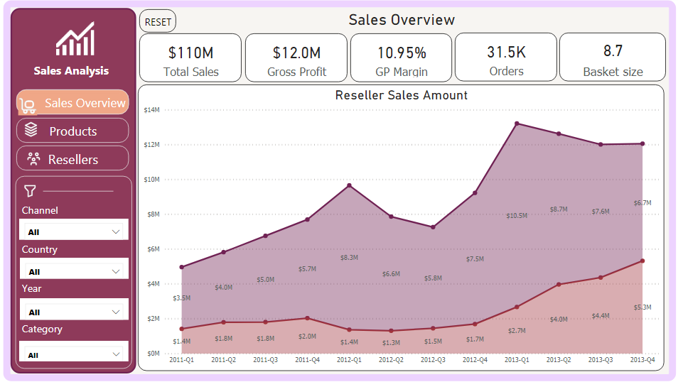
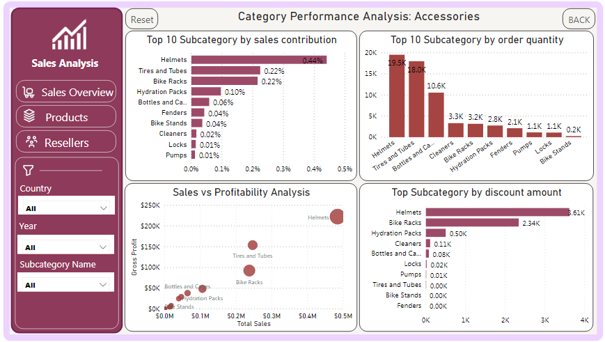

# AdventureWorks Sales Performance Dashboard

## Project Overview

This project is an end-to-end Business Intelligence solution developed in Power BI using the AdventureWorks data warehouse. The dashboard provides interactive sales analytics, product performance monitoring, reseller analysis, and drill-through capabilities to support data-driven decision-making.

The solution was designed following BI best practices, including data modeling, DAX calculations, KPI monitoring, and interactive report navigation.

## Business Objective

This dashboard was designed to help executives and business stakeholders identify the most promising opportunities for business growth and expansion.

By combining sales performance, product profitability, cost analysis, and reseller engagement metrics, the solution enables decision-makers to determine:

- Which product categories deserve further investment
- Which markets show the strongest growth potential
- Where profitability is being lost due to cost inefficiencies
- Which reseller networks require attention or expansion
- How resources can be allocated to maximize future business growth

## Dashboard Pages

### Sales Overview
Executive-level dashboard designed to monitor overall business performance.

Key KPIs

Total Sales
Gross Profit
Gross Profit Margin
Total Orders
Basket Size

Visual Analysis

Reseller Sales Trend
Internet Sales Trend
Sales Growth Monitoring
Performance Trend Lines

---

### Product Analytics

Provides category-level product performance analysis and serves as the starting point for deeper exploration.

Key KPIs

* Total Products
* Profit per Unit
* Active Products
* Top Category Contribution
* Top Product Share

### Visual Analysis

* Order Quantity by Product Category
* Total Cost by Category
* Basket Size by Product Category
* Profit Margin by Category

This page provides a high-level overview of product performance and enables users to drill into category-specific analysis.

---

## Subcategory Performance Analysis (Drill-through)

Allows users to drill from a product category into detailed subcategory performance analysis.

### Analysis Includes

* Top Subcategories by Sales Contribution
* Top Subcategories by Order Quantity
* Sales vs. Gross Profit Analysis
* Discount Amount Analysis

### Example: Accessories Category Analysis

This page helps users identify which subcategories drive sales, profitability, and demand while also highlighting the impact of discounts on overall performance.

By combining contribution, demand, profitability, and discount metrics, decision-makers can better understand category dynamics and support product strategy, pricing, and promotional decisions.

---

### Reseller performance across different countries.

Analysis Includes

Sales Growth by Country
Country Growth vs Profitability
Sales Contribution Analysis
Active Reseller Rate
Reseller Churn Rate

This page helps identify strong reseller markets and retention challenges.

---

## Data Model

Displays the underlying star schema used to support reporting and analysis.

Model Characteristics

Fact and Dimension Tables
One-to-Many Relationships
Optimized Star Schema Design
Performance-Oriented Data Modeling

---

## Key Features
Interactive Filtering
Dynamic KPI Monitoring
Drill-through Navigation
Cross-Filtering & Cross-Highlighting
Product Performance Analysis
Cost & Profitability Analysis
Reseller Analytics
Trend Analysis
DAX Measures
Star Schema Data Modeling

---

## Tools & Technologies
Power BI Desktop
Power Query
DAX
Data Modeling
Star Schema Design
Drill-through Navigation
Data Visualization
KPI Design
AdventureWorks Data Warehouse

---

## Dashboard Screenshots
### Sales Overview

### Products

### Subcategory Details Drill-through

### Resellers

### Data Model

---

## Author

Elham Ghorbani  
Business Intelligence Developer

